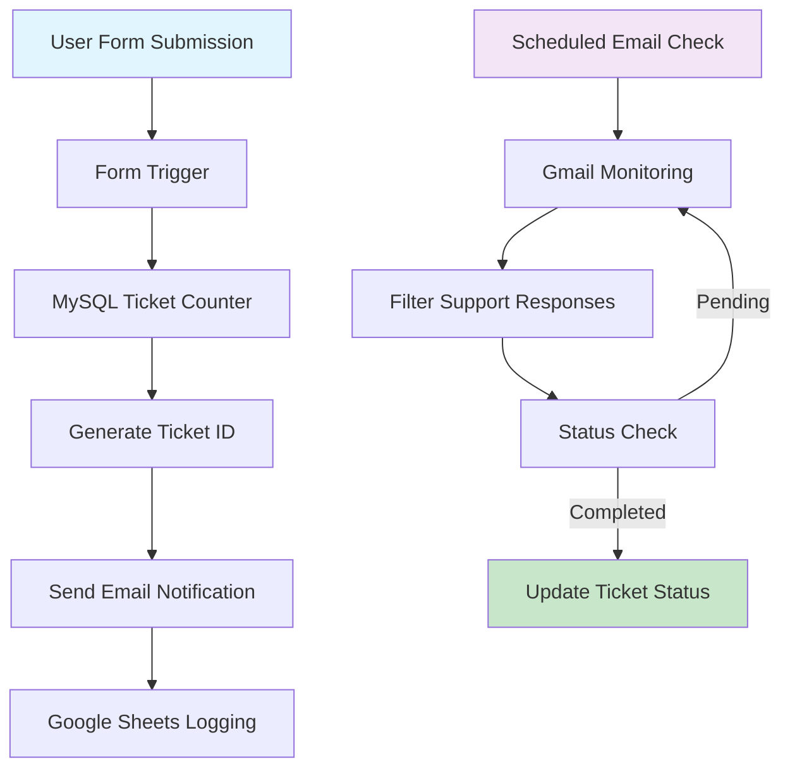

# 🎫 IT Ticket Management System - n8n Workflows


A complete automated IT support ticket management system built with n8n that handles ticket creation, tracking, and status updates through form submissions and email integration.

---

## 🏗️ Overview

This project consists of two interconnected n8n workflows that automate the entire IT support ticket lifecycle, from initial ticket creation through resolution tracking and status updates.

---

## Workflows Included:

1.IT Ticket Management System - Handles new ticket creation and initial processing

2.Ticket Status Tracker - Monitors email responses and updates ticket status automatically

### ✨ Features

## 🎯 Core Functionality

- Automated Ticket Creation - From web form submissions.

- Unique Ticket ID Generation - Sequential numbering with custom prefixes.

- Real-time Email Notifications - Instant alerts to support team.

- Centralized Ticket Logging - Google Sheets integration for reporting.

- Automated Status Updates - Email-based ticket closure system.

- Priority Management - Support for Low, Medium, High priority levels.


## 🔧 Technical Features
- Missing values are filled:
  - Categorical: `'None'`
  - Numerical: `0`
- Categorical features are label-encoded using `LabelEncoder`.

### 3. 🛠️ Feature Engineering
- MySQL Integration - Reliable ticket counter management.

- Gmail Integration - Seamless email communication.

- Google Sheets API - Comprehensive audit trails.

- Custom JavaScript Logic - Flexible business rules.

- Scheduled Monitoring - Automated email checking.

- Conditional Processing - Smart ticket status detection.


## 🏗️ System Architecture

### Diagram


### 📊 Workflow Details

# 1. IT Ticket Management System (IT Ticket Management System.json)
Purpose: Creates and processes new IT support tickets from form submissions.

Form Submission → MySQL Ticket Number Generation → Email Notification → Google Sheets Logging

Form Fields:
👤 Name (required) - Requester's full name

🏢 Department (required) - Department/team name

🐛 Issue Description (required) - Detailed problem description

⚡ Priority Level (required) - Low, Medium, High

Technical Components:
n8n-nodes-base.formTrigger - Web form handling

n8n-nodes-base.mySql - Database operations for ticket numbering

n8n-nodes-base.gmail - Email notifications to support team

n8n-nodes-base.googleSheets - Data logging and audit trail

n8n-nodes-base.code - Custom JavaScript for ticket ID generation

# 2. Ticket Status Tracker (Ticket_Status_Tracker.json)
Purpose: Monitors email responses and automatically updates ticket status.

Scheduled Email Check → Filter Support Responses → Update Ticket Status → Close Tickets

Email Filtering Criteria:
📧 Subject: Contains "Re: Norpetco IT Ticket Support System"

👨‍💼 Sender: Specific support personnel email

✅ Content: Contains completion keywords (Done/accomplished/solved)

Technical Components:
n8n-nodes-base.scheduleTrigger - Time-based execution (every minute)

n8n-nodes-base.gmail - Email monitoring and retrieval

n8n-nodes-base.if - Conditional filtering logic

n8n-nodes-base.googleSheets - Status updates in spreadsheet

n8n-nodes-base.splitInBatches - Batch processing for multiple emails


### 🚀 Installation

# Prerequisites
✅ n8n instance (self-hosted or n8n.cloud).

✅ MySQL database (version 5.7 or higher).

✅ Gmail/Google Workspace account.

✅ Google Sheets document.

✅ Proper OAuth2 credentials configured in n8n.


## Step 1: Database Setup

Create the required MySQL table:

```sql
CREATE TABLE ticket_counter (
    id INT PRIMARY KEY,
    current_number INT,
    ticket_prefix VARCHAR(50)
);

-- Insert initial data
INSERT INTO ticket_counter (id, current_number, ticket_prefix) 
VALUES (1, 0, 'TICKET');
```

## Step 2: Google Sheets Setup
Create a new Google Sheet with the following columns:

| Column Name         | Type     | Description                          |
|---------------------|----------|--------------------------------------|
| Ticket ID           | String   | Auto-generated ticket identifier     |
| Name                | String   | Requester's name                     |
| Department          | String   | Department/team                      |
| Issue               | String   | Problem description                  |
| Priority            | String   | Low/Medium/High                      |
| Date                | DateTime | Submission timestamp                 |
| Status              | String   | Open/Closed                          |
| Thread_ID           | String   | Gmail thread identifier              |
| Done By             | String   | Support agent who resolved           |
| Solution Description| String   | Resolution details                   |


## Step 3: n8n Configuration

### Import Workflows
1. Navigate to n8n dashboard
2. Click "Import from file"
3. Select both JSON workflow files

### Configure Credentials
- Set up Gmail OAuth2 credentials
- Configure MySQL database connection
- Add Google Sheets OAuth2 integration

## Step 4: Activate Workflows
1. Toggle both workflows to "Active" state
2. Test the form submission process
3. Verify email notifications are working

## ⚙️ Configuration
### Environment Variables

```bash

# Database Configuration
N8N_DB_HOST=your_mysql_host
N8N_DB_USER=your_mysql_user
N8N_DB_PASSWORD=your_mysql_password
N8N_DB_NAME=your_database_name

# Email Configuration
N8N_EMAIL_FROM=support@yourcompany.com
N8N_EMAIL_TO=it-team@yourcompany.com

# Webhook Configuration
N8N_PROTOCOL=https
N8N_HOST=your-n8n-domain.com
N8N_PORT=5678

```

## ⚙️ Configuration

### Workflow Settings

#### Main Workflow:
- **Timezone**: Africa/Cairo
- **Execution Order**: v1
- **Error Handling**: All errors saved

#### Tracker Workflow:
- **Schedule**: Every 60 seconds
- **Email Limit**: 10 messages per check
- **Batch Size**: 1 item per operation

## 📖 Usage

### Accessing the Form
The IT support form is accessible at: `http://your-n8n-domain:5678/form/3f77ac00-3986-459d-8c79-77e8effa4e57`

## 🔄 Form Submission Process

1. **User fills out the form** with their issue details
2. **System generates unique Ticket ID** (e.g., TICKET-0001)
3. **Email notification sent** to support team with all details
4. **Ticket logged in Google Sheets** with "Open" status
5. **Support team responds** via email to resolve the issue

## ✅ Ticket Closure Process

1. **System monitors emails** every minute for responses
2. **Identifies completion emails** based on predefined criteria
3. **Updates ticket status** to "Closed" in Google Sheets
4. **Logs resolution details** and support agent information


## 🤝 Contributing

We welcome contributions to improve this IT Ticket Management System!

### Development Setup
1. **Fork the repository**
2. **Create a feature branch**: `git checkout -b feature/improvement`
3. **Test changes** in your n8n instance
4. **Submit a pull request** with detailed description

### Best Practices
- Maintain backward compatibility when modifying workflows
- Test all changes in a development environment
- Update documentation for any new features
- Follow n8n node naming conventions

## 📄 License

This project is licensed under the **MIT License** 

## 🆘 Support

For support and questions:
- 📧 **Email**: [mohamedmaherr12310@gmail.com](mailto:mohamedmaherr12310@gmail.com)
- 🐛 **Create an issue** in the GitHub repository
- 📚 **Check n8n documentation**: [docs.n8n.io](https://docs.n8n.io)

## 🔄 Version History

### v1.0 (2024-01-15)
- **Initial release**
- Basic ticket creation and tracking
- Email integration
- Google Sheets logging